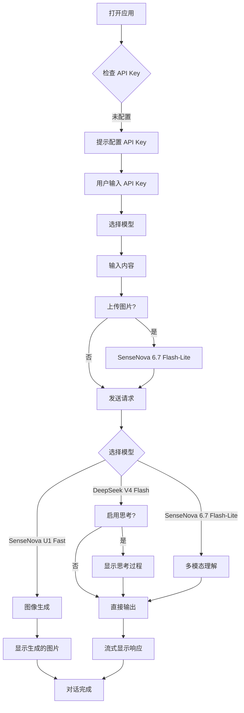

# SenseNova 多模型 AI 对话平台 - 产品需求文档

## 1. 产品概述

一个统一的多模型 AI 对话平台，整合 SenseNova 6.7 Flash-Lite、SenseNova U1 Fast 和 DeepSeek V4 Flash 三大模型能力。用户可以自由选择模型、输入文本或上传图片，获得智能对话和图像生成服务。

**核心价值**：
- 一站式访问多个顶级 AI 模型
- 支持文本对话和多模态图像理解
- 专业信息图生成能力
- 简洁直观的用户界面

**目标用户**：
- 需要 AI 辅助写作、问答的用户
- 需要图像理解和分析的用户
- 需要生成信息图的专业人士

## 2. 核心功能

### 2.1 用户角色
| 角色 | 注册方式 | 核心权限 |
|------|----------|----------|
| 普通用户 | API Key 配置 | 使用所有模型功能 |

### 2.2 功能模块

#### 2.2.1 模型选择与配置
- **模型选择器**：下拉菜单选择三个模型之一
  - SenseNova 6.7 Flash-Lite（多模态对话）
  - SenseNova U1 Fast（信息图生成）
  - DeepSeek V4 Flash（深度思考对话）
- **API Key 管理**：用户输入并保存个人的 API Key
- **模型信息卡片**：显示当前模型的特性说明

#### 2.2.2 对话交互界面
- **消息输入区**：
  - 文本输入框（支持多行）
  - 图片上传按钮（仅 SenseNova 6.7 Flash-Lite）
  - 发送按钮
  - 清空对话按钮
- **对话显示区**：
  - 用户消息气泡（右侧，蓝色主题）
  - AI 响应气泡（左侧，白色主题）
  - 流式输出显示
  - 思考过程显示（DeepSeek V4 Flash）
  - 图片响应显示（U1 Fast 生成）
- **Token 使用统计**：显示当前对话的 token 消耗

#### 2.2.3 DeepSeek V4 Flash 特殊功能
- **思考模式开关**：启用/禁用 AI 思考过程
- **思考过程展示**：可折叠的思考内容显示区

#### 2.2.4 SenseNova U1 Fast 图像生成
- **图像尺寸选择**：支持多种宽高比
- **生成数量选择**：1-4 张图片
- **图片预览与下载**：大图预览，一键下载

### 2.3 页面详情
| 页面名称 | 模块名称 | 功能描述 |
|----------|----------|----------|
| 主界面 | 模型选择器 | 顶部固定，选择当前使用的模型 |
| 主界面 | API Key 输入 | 模态框配置，用户输入自己的 API Key |
| 主界面 | 对话区域 | 中央主体，显示历史对话和当前对话 |
| 主界面 | 输入区域 | 底部固定，文本输入和图片上传 |
| 主界面 | 设置面板 | 右侧滑出，各模型的参数配置 |

## 3. 核心流程

### 3.1 用户使用流程
1. **首次访问**：用户打开应用 → 弹出 API Key 配置提示 → 输入 API Key
2. **选择模型**：用户从模型列表中选择所需模型
3. **配置参数**：根据模型调整参数（思考模式、图片尺寸等）
4. **输入内容**：输入文本或上传图片
5. **发送请求**：点击发送按钮
6. **查看响应**：流式查看 AI 响应
7. **保存结果**：复制文本或下载图片

### 3.2 流程图

## 4. 用户界面设计

### 4.1 设计风格

**主题**：深邃科技感 + 温暖交互

**色彩方案**：
- **主色调**：
  - 深色背景：`#0f1419`（深墨色）
  - 侧边栏：`#1a1f26`（深灰蓝）
  - 卡片背景：`#242b35`（中灰蓝）
- **强调色**：
  - SenseNova 蓝：`#3b82f6`
  - DeepSeek 紫：`#8b5cf6`
  - U1 金橙：`#f59e0b`
  - 成功绿：`#10b981`
  - 错误红：`#ef4444`
- **文字色**：
  - 主文字：`#f1f5f9`
  - 次要文字：`#94a3b8`
  - 辅助文字：`#64748b`

**字体**：
- 主字体：`"Noto Sans SC", "PingFang SC", "Microsoft YaHei", sans-serif`
- 代码字体：`"JetBrains Mono", "Fira Code", monospace`

**布局**：
- 左侧边栏：模型选择和设置（280px）
- 中央主区域：对话界面（flex-grow）
- 底部固定：输入区域（最小 120px）

**动效**：
- 模型切换：平滑渐变过渡（300ms）
- 消息气泡：淡入上升动画（200ms）
- 加载状态：优雅的脉冲动画
- 思考过程：打字机效果，逐字显示

### 4.2 页面设计概览

| 页面名称 | 模块名称 | UI 元素 |
|----------|----------|---------|
| 主界面 | 模型卡片 | 圆角卡片（12px），图标+名称+描述，悬停发光效果 |
| 主界面 | 对话气泡 | 用户右对齐（蓝色渐变），AI 左对齐（灰白），圆角（16px） |
| 主界面 | 输入框 | 透明背景，边框发光（聚焦时），圆角（12px） |
| 主界面 | 按钮 | 渐变背景，圆角，悬停缩放（1.02x） |
| 主界面 | 设置面板 | 滑入动画，网格布局，范围滑块 |

### 4.3 响应式设计

- **桌面优先**（≥1024px）：完整三栏布局
- **平板适配**（768px-1023px）：侧边栏可收起
- **移动端**（<768px）：底部标签栏切换，单列布局

### 4.4 特殊交互

- **图片上传**：拖拽区域，虚线边框，悬停高亮
- **思考过程**：可折叠面板，斜体显示，带图标标识
- **图片预览**：点击放大，居中弹窗，背景模糊
- **错误提示**：红色边框，抖动动画，清晰错误信息
