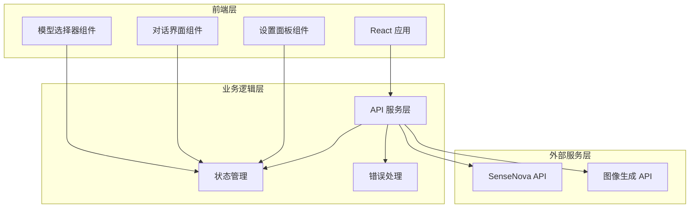

# SenseNova 多模型 AI 对话平台 - 技术架构文档

## 1. 架构设计

### 1.1 系统架构图


### 1.2 技术选型

- **前端框架**：React@18 + TypeScript
- **构建工具**：Vite
- **样式方案**：Tailwind CSS@3
- **状态管理**：React Context + useReducer
- **HTTP 客户端**：fetch API (原生)
- **包管理**：npm

### 1.3 项目结构
```
/src
  /components
    - ModelSelector.tsx        # 模型选择器
    - ChatInterface.tsx        # 对话界面
    - MessageBubble.tsx        # 消息气泡
    - InputArea.tsx            # 输入区域
    - SettingsPanel.tsx       # 设置面板
    - ImageUploader.tsx        # 图片上传
    - ThinkingDisplay.tsx     # 思考过程显示
  /contexts
    - AppContext.tsx           # 全局状态管理
  /services
    - apiService.ts           # API 调用服务
  /types
    - index.ts                # TypeScript 类型定义
  /styles
    - index.css               # 全局样式
  - App.tsx                   # 主应用组件
  - main.tsx                  # 入口文件
  - index.html                # HTML 模板
```

## 2. API 定义

### 2.1 前端配置接口

#### 2.1.1 设置 API Key
```typescript
interface ApiKeyConfig {
  apiKey: string;
}
```

#### 2.1.2 模型配置
```typescript
interface ModelConfig {
  model: 'sensenova-6.7-flash-lite' | 'deepseek-v4-flash' | 'sensenova-u1-fast';
  temperature?: number;
  maxTokens?: number;
  thinking?: {
    enabled: boolean;
    effort?: 'high' | 'low';
  };
  imageSize?: string;
  imageCount?: number;
}
```

### 2.2 API 服务接口

#### 2.2.1 聊天完成接口
```typescript
interface ChatRequest {
  model: string;
  messages: Message[];
  stream?: boolean;
  temperature?: number;
  max_tokens?: number;
  thinking?: object;
}

interface Message {
  role: 'system' | 'user' | 'assistant' | 'tool';
  content: string | ContentBlock[];
}

interface ContentBlock {
  type: 'text' | 'image_url';
  text?: string;
  image_url?: {
    url: string;
  };
}

interface ChatResponse {
  id: string;
  model: string;
  choices: [{
    message: {
      role: string;
      content: string;
      reasoning_content?: string;
    };
    finish_reason: string;
  }];
  usage: {
    prompt_tokens: number;
    completion_tokens: number;
    total_tokens: number;
  };
}
```

#### 2.2.2 图像生成接口
```typescript
interface ImageRequest {
  model: 'sensenova-u1-fast';
  prompt: string;
  size?: string;
  n?: number;
}

interface ImageResponse {
  created: number;
  data: [{
    url: string;
  }];
}
```

### 2.3 流式响应处理

#### 2.3.1 SSE 事件流
```typescript
// 文本响应流
data: {"id":"...","choices":[{"index":0,"delta":{"content":"..."}}]}
data: [DONE]

// 包含 usage 的流
data: {"id":"...","choices":[...],"usage":{...}}
data: [DONE]
```

#### 2.3.2 流式响应解析
```typescript
// 解析 SSE 事件
function parseSSEStream(response: Response): AsyncGenerator<string> {
  const reader = response.body?.getReader();
  const decoder = new TextDecoder();

  return {
    async *[Symbol.asyncIterator]() {
      let buffer = '';
      while (true) {
        const { done, value } = await reader.read();
        if (done) break;

        buffer += decoder.decode(value, { stream: true });
        const lines = buffer.split('\n');
        buffer = lines.pop() || '';

        for (const line of lines) {
          if (line.startsWith('data: ')) {
            const data = line.slice(6);
            if (data === '[DONE]') return;
            yield JSON.parse(data);
          }
        }
      }
    }
  };
}
```

## 3. 数据模型

### 3.1 对话消息
```typescript
interface ChatMessage {
  id: string;
  role: 'user' | 'assistant' | 'system' | 'tool';
  content: string;
  reasoningContent?: string;  // DeepSeek 思考过程
  images?: string[];          // 用户上传的图片 URL
  timestamp: number;
  model: string;             // 使用的模型
  tokens?: {
    prompt: number;
    completion: number;
    total: number;
  };
}
```

### 3.2 应用状态
```typescript
interface AppState {
  apiKey: string;
  currentModel: string;
  messages: ChatMessage[];
  isLoading: boolean;
  config: {
    temperature: number;
    maxTokens: number;
    thinking: {
      enabled: boolean;
      effort: 'high' | 'low';
    };
    imageSize: string;
    imageCount: number;
  };
  error: string | null;
}
```

### 3.3 本地存储
```typescript
// localStorage keys
const STORAGE_KEYS = {
  API_KEY: 'sensenova_api_key',
  MODEL_CONFIG: 'sensenova_model_config',
  CONVERSATION_HISTORY: 'sensenova_conversation_history'
};
```

## 4. 核心组件设计

### 4.1 ModelSelector 组件
- **功能**：模型选择下拉菜单
- **Props**：
  - `currentModel: string`
  - `onModelChange: (model: string) => void`
- **状态**：下拉展开/收起
- **交互**：点击切换模型，触发配置更新

### 4.2 ChatInterface 组件
- **功能**：对话主界面
- **Props**：
  - `messages: ChatMessage[]`
  - `isLoading: boolean`
  - `onSendMessage: (content: string, images?: string[]) => void`
- **特性**：
  - 消息列表自动滚动到底部
  - 加载状态显示骨架屏
  - 空状态引导提示

### 4.3 InputArea 组件
- **功能**：消息输入区域
- **Props**：
  - `onSend: (content: string, images: string[]) => void`
  - `disabled: boolean`
  - `supportsImages: boolean`
- **特性**：
  - 支持多行文本输入
  - 图片拖拽上传
  - 回车发送，Shift+Enter 换行
  - 发送按钮状态管理

### 4.4 SettingsPanel 组件
- **功能**：模型参数配置面板
- **Props**：
  - `config: ModelConfig`
  - `onConfigChange: (config: ModelConfig) => void`
- **参数**：
  - Temperature 滑块
  - Max Tokens 输入
  - 思考模式开关（仅 DeepSeek）
  - 图像尺寸选择（仅 U1 Fast）
  - 生成数量选择（仅 U1 Fast）

### 4.5 ThinkingDisplay 组件
- **功能**：DeepSeek 思考过程展示
- **Props**：
  - `content: string`
  - `isStreaming: boolean`
- **特性**：
  - 可折叠面板
  - 打字机效果
  - 斜体样式显示

### 4.6 ImagePreview 组件
- **功能**：图片预览和下载
- **Props**：
  - `url: string`
  - `alt?: string`
- **交互**：
  - 点击放大预览
  - 下载按钮
  - 背景模糊遮罩

## 5. 错误处理策略

### 5.1 API 错误类型
```typescript
interface ApiError {
  type: 'invalid_request_error' | 'quota_exceeded_error' | 'internal_server_error';
  code: string;
  message: string;
}
```

### 5.2 错误处理流程
1. **网络错误**：显示"网络连接失败，请检查网络"
2. **认证错误（401/403）**：提示"API Key 无效或权限不足"
3. **配额超限（429）**：提示"请求过于频繁，请稍后重试"
4. **服务端错误（500）**：提示"服务器繁忙，请稍后重试"
5. **参数错误（400）**：显示具体错误信息

### 5.3 重试机制
- 自动重试：3 次重试，间隔 1s, 2s, 4s
- 指数退避：429 错误使用指数退避

## 6. 性能优化

### 6.1 流式响应优化
- 使用 ReadableStream 实时解析 SSE
- 虚拟滚动：消息列表超过 100 条时启用
- 懒加载：历史消息按需加载

### 6.2 图片处理
- 客户端图片压缩（最大 2MB）
- 转为 Base64 格式上传
- 图片缓存策略

### 6.3 状态管理优化
- 使用 useMemo 缓存计算结果
- 使用 useCallback 优化回调函数
- 合理拆分 Context 避免不必要的重渲染
